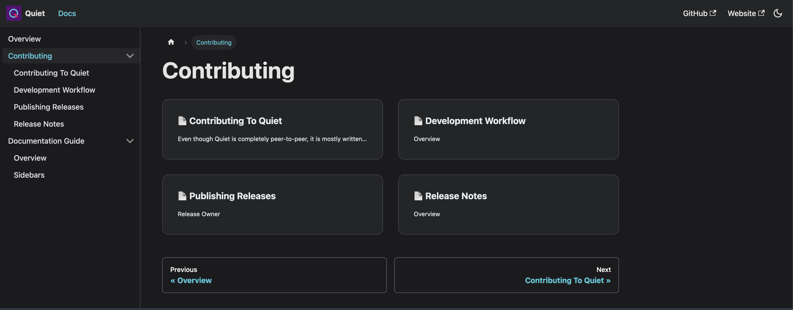

# Sidebars

The sidebar organizes the documentation pages in a structure that is auto-generated from the `/docs` directory structure and any `_category_.json` files they contain.



## Sidebar Config

The main sidebar config is in `sidebars.ts` and is currently specified to auto-generate using the docs structure.  This can be updated in the future if we want more control over how the sidebar is configured.

```typescript
docsSidebar: [{type: 'autogenerated', dirName: '.'}],
```

For more information check out the official Docusaurus guide [here](https://docusaurus.io/docs/sidebar).

## Structure

There are a few ways that Docusaurus determines the structure of the sidebar:

1. Directories
2. \_category\_.json
3. Pages

### Directories

All pages under a given directory are grouped together automatically.  If you want to add a page to an existing group you _must_ add that page to the corresponding directory.  Any files in the top-level `/docs` directory will be ungrouped by default.

### \_category\_.json

These files live under each sub-directory and contain information on how the top-level page for a grouping appears, as well as where that group lives in the sidebar.  

#### Example

```json
{
  "label": "Contributing",
  "position": 2,
  "link": {
    "type": "generated-index"
  }
}
```

#### Guide

* `label` - Sets the name of the group in the sidebar
* `position` - Determines the position of the group in the sidebar ordering
* `link` - Determines the way links are generated/displayed on the root page of a group

For more information check out the official Docusaurus guide [here](https://docusaurus.io/docs/sidebar/autogenerated#category-item-metadata).

### Pages

Pages can contain metadata at the top.  Here we can set the position within the group in the sidebar, among other things.

#### Example

```markdown
---
sidebar_position: 2
title: Sidebars
---
```

#### Guide

* `sidebar_position` - Sets the order of the page in the sidebar group
* `title` - Title to be displayed in the sidebar for this page

For more information check out the official Docusaurus guide [here](https://docusaurus.io/docs/markdown-features#front-matter).


