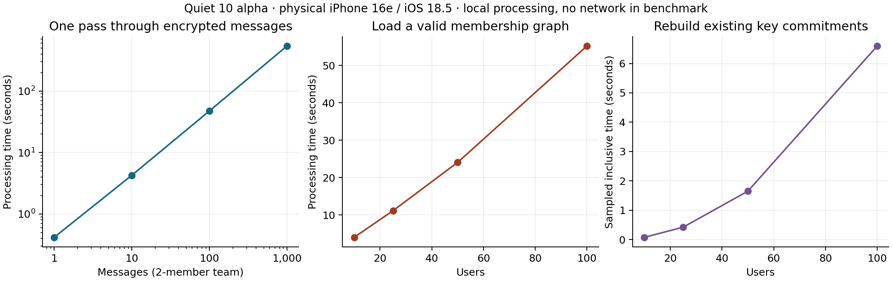

# iOS processing profile: Quiet 10 alpha

**The iOS delay is reproducible local CPU work.** On the physical iPhone, one
pass through 1,000 authentic encrypted messages took **541.8 seconds**. Loading
a valid 100-user sigchain took **55.2 seconds**. The main causes are repeated
LFA key validation on a slow JavaScript crypto fallback, repeated channel-history
processing, and repeated scans of existing sigchain lockboxes.

These measurements explain the client-side delay seen in the
[staging QSS tests](staging-qss-3-alpha-2026-09-14.md). Those tests required QSS
delivery because the desktop peer's Tor networking was disabled. This stress
test operates entirely on offline fixtures; server response time and Tor cannot
explain its processing durations. No QSS server was changed or stress-loaded.

## Physical iPhone measurements

Device: iPhone 16e, iOS 18.5. App: published `10.0.0-alpha.0` (build 613),
Quiet commit `edd51028f3c66c30d0692e8833fa7d0a7266b242`, LFA/auth
`6f534c89bceb875e8c71997943e5e76e48ccbd88`. The released backend payload was
instrumented and the app development-signed. Its frontend, native frameworks,
configuration and crypto algorithms were unchanged.

The message cases use an ordinary member in a two-user team:

| Messages | Decrypt and verify every message once |
| ---: | ---: |
| 1 | 0.416 s |
| 10 | 4.255 s |
| 100 | 47.420 s |
| 1,000 | 541.801 s |

All requested messages completed, with exact-content and signature assertions.
The 1,000-message case used 540.1 seconds of user CPU time and 2.3 seconds of
system CPU time. There was no timeout or crash. Its average cost rose from the
short-run 0.42 seconds/message to 0.54 seconds/message under sustained load;
thermal/power state was not controlled, so this increase is not attributed to
message-count complexity.

The real Quiet `ChannelStore.refreshMessageIds()` path, using an in-memory
iterator but unchanged consume/validation/crypto methods, took **0.563 seconds
for 1 message, 5.627 seconds for 10, and 57.058 seconds for 100**. Thus even a
100-message channel already incurs nearly a minute for one ID refresh. These
are backend durations, not an experimentally determined UI-freeze threshold.
The earlier live tests independently observed delayed visible delivery.

## Where crypto runs and why it is expensive

This path runs in the embedded Node backend on its own native thread, launched
by [RNNodeJsMobile](https://github.com/TryQuiet/quiet/blob/edd51028f3c66c30d0692e8833fa7d0a7266b242/packages/mobile/ios/NodeJsMobile/RNNodeJsMobile.m).
The app has a frontend WebView crypto helper, but the measured message path does
not use it. The phone reports Node Mobile **18.20.4**, V8
**10.2.154.26-node.37**, and `typeof WebAssembly === "undefined"`.
Node Mobile's [matching build documentation](https://github.com/nodejs-mobile/nodejs-mobile/blob/v18.20.4/doc_mobile/BUILDING.md#building-the-ios-framework-library-on-macos)
specifies V8 with JIT disabled on iOS. This is a limitation of this embedded
runtime; it does not mean all iOS JavaScript environments lack WebAssembly.

The actual call path is public-message consume → `CryptoService.decryptAndVerify`
→ `team.decrypt` → `team.keys` → `keyMap` → `visibleKeys` → lockbox opening and
keyset validation. Each message reconstructs the same accessible key map.

For **each ordinary-member message**, the released implementation performs:

- **13** Ed25519 keypair reconstructions and **13** Curve25519 public-key
  derivations to revalidate keysets;
- **3** asymmetric lockbox decryptions;
- **1** actual message-signature verification and symmetric message decryption.

Across 1,000 messages, key lookup consumed **490.9 seconds: 90.6%** of the total.
The keypair reconstructions consumed 352.5 seconds, lockbox decryption 125.9
seconds, and message-signature verification 48.4 seconds. Actual symmetric
message decryption consumed only **1.48 seconds for all 1,000 messages**.
Nested inclusive timings overlap and must not be added together.

Two controls distinguish the application problem from measurement overhead:

| Physical-phone control | Result |
| --- | ---: |
| 10 messages, instrumentation enabled | 5.600 s |
| 10 messages, instrumentation disabled | 5.598 s |
| 1,000 messages, reuse one already validated role key and still verify every signature | 57.451 s |

The observed elapsed-time ratio is **9.43×**. The app remained connected to its
existing live community; while this control yielded between batches, background
auth added 11 signature checks and 2.63 seconds of key lookup. No background time
was subtracted. Every normal decrypt/verify phase, including the 1,000-message
baseline, has exactly its expected crypto call counts. This is a diagnostic
control, not a production cache: membership changes, key rotation, revocation,
mutation and cache lifetime/invalidation still require implementation and tests.
Even this control spends nearly a minute on 1,000 messages, so the JavaScript
signature-verification fallback remains a meaningful bottleneck.

The 45-second startup CPU profile contains 13.81 seconds of active samples;
**94.4% of active sampled time is inside libsodium's JavaScript fallback**.
Linux controls using the same release payload and fixtures measured about
1.07 ms/message with normal Node/WASM, 24.1 ms with WASM disabled but JIT enabled,
and 401.8 ms with `--jitless`. These are runtime controls on different hardware,
not desktop UI benchmarks. They reproduce the order of magnitude seen on iOS.

## Quadratic work in channel history and sigchain replay

**Channel history:** the released update handler consumes the arriving message,
then calls `refreshMessageIds()`, which decrypts/verifies the entire history to
obtain IDs. Executing that actual handler for serial arrivals, with a counted
consumer replacing crypto, produced:

| New messages, starting empty | Calls to consume a message |
| ---: | ---: |
| 1 | 2 |
| 10 | 65 |
| 100 | 5,150 |
| 1,000 | 501,500 |

The count is `N + N(N+1)/2`. Both Linux and the phone passed these assertions.
These are measured work counts; a full 501,500-decryption phone run was not
attempted. Concurrent arrival scheduling may interleave more history reads,
and frontend missing-message requests can add further work.

**Sigchain loading:** fixtures use real protocol-4 invitations, possession proofs,
admissions, device joins and role grants. They contain 31/76/151/301 graph links
at 10/25/50/100 users, with 33/78/153/303 lockboxes respectively.

| Users | Load sigchain | Process 10 messages after load | Rebuild existing commitments, sampled inclusive time |
| ---: | ---: | ---: | ---: |
| 10 | 4.047 s | 5.633 s | 0.077 s |
| 25 | 11.157 s | 5.664 s | 0.423 s |
| 50 | 24.077 s | 5.646 s | 1.649 s |
| 100 | 55.207 s | 5.608 s | 6.598 s |

Increasing membership barely changes this ordinary member's per-message cost.
It increases graph-loading cost. At 100 users, the load performs 301 asymmetric
decryptions and 499 signature verifications. The CPU profile attributes 41.18
of 55.25 sampled seconds to libsodium; garbage collection is only 0.13 seconds.

The measurable quadratic component is
[`authorizedLockboxes` → `establishedCommitments`](https://github.com/TryQuiet/auth/blob/6f534c89bceb875e8c71997943e5e76e48ccbd88/packages/auth/src/team/lockboxAuthorization.ts):
each applicable replayed link rebuilds a map by scanning and structurally
revalidating previous lockboxes. Its 25→50→100-user sampled cost increases about
fourfold at each doubling. Related filtering revalidates the same manifests again.
Total `authorizedLockboxes` inclusive time is 13.52 seconds at 100 users,
including the 6.60-second commitment scan. Graph-concurrency code also contains
nested traversal, but it is not the leading quadratic cost in this profile.

## Relationship to versions 8 and 9

Version 8 pins auth `018421c01a6840bcf0329ae8144730edda84e5c5`, whose lockbox
opening is memoized. Auth commit
[`8a30e071f`, August 24: keyset manifest binding](https://github.com/TryQuiet/auth/commit/8a30e071f)
removed that memoization and added cryptographic keyset/manifest validation.
It is included in the auth pin of **9.0.2**
(`742ea3dad6d07d54d745fc61b3afd72f5f2a2b59`) and **10 alpha**. The relevant
production lockbox, authorization and key-selector code is unchanged between
those two pins. The full-history reread also already existed in version 8.

This identifies a concrete 8→9 regression candidate and explains why the same
problem remains in 10. It is not a newly measured 8/9/10 phone timing comparison
or a completed historical bisect. The newer validation binds cryptographic
material to its authorization manifests; removing those checks is not an
acceptable performance fix.

## Fix direction and handoff

Implementation is tracked separately: **[#3536, message-history growth](https://github.com/TryQuiet/quiet/issues/3536)
is first priority**, followed by [#3537, sigchain/user growth](https://github.com/TryQuiet/quiet/issues/3537).
[#3538, iOS native crypto](https://github.com/TryQuiet/quiet/issues/3538) runs in parallel.
Each issue includes the relevant measurements, security boundaries and acceptance tests.

1. Maintain an incrementally updated, validated history index; coalesce catch-up
   refreshes. Preserve checks that exclude undecryptable, invalid or unauthorized
   entries. A raw encrypted-ID list is not automatically equivalent.
2. Reuse validated key material and opened lockboxes with caches that bind all
   security-relevant inputs and invalidate correctly. Keep message-signature
   verification and manifest binding. Test altered ciphertext/manifests/secret
   keys, removal, rotation and generation changes before shipping.
3. Maintain the established-commitment index incrementally during sigchain
   reduction instead of rescanning all prior lockboxes for every link.
4. Move the expensive primitives to a compatible native crypto implementation
   for the embedded iOS backend, with cross-platform format and tamper tests.

The committed work is profiling infrastructure, realistic tests and evidence;
**no product crypto or authentication fix is shipped by this change**.

The [reproduction guide](../ios-profile/README.md) describes instrumentation,
fixtures, on-device commands and runtime controls. The
[sanitized result artifact](ios-processing-profile-2026-09-14.json) includes
measurements, call counts, sampled CPU attribution and private-evidence checksums.
Private keys, messages, raw logs and CPU profiles remain under ignored
`.connection-runs/ios-processing-profile/` and the Mac profiling directory.

Limits: one phone; one pass per scale point; tests ordered by increasing size;
uncontrolled thermal/power state; graph loads share a process and may benefit
from common-prefix caches; one message author and stable role membership.
Forked/concurrent sigchains, key rotations, attachments and rendering thousands
of message rows were not stressed. The offline fixtures were not inserted into
the user's live community. Early harness attempts failed on signing/container
permissions and are not counted as application failures.

The original development-signed alpha app was restored without uninstalling or
clearing its data. Its original backend hash and signature were checked, and it
reconnected/authenticated to staging QSS and read the existing five-message
history. The owned signing LaunchAgent was removed. Diagnostic files are retained
separately from community storage for reproducibility. The restored app's test
process was stopped after this validation.
